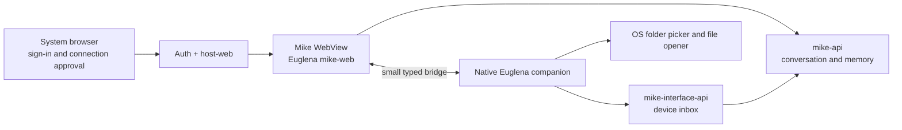

# Mike desktop: product and delivery plan

Status: **implementation in progress** · 2026-09-28

## Decision and product boundary

Build a **Mike** desktop application. Its main view uses the existing Euglena
`mike-web` conversation, rendered in an embedded WebView without a browser
address bar. The native Euglena application remains responsible for device
identity, connection state, and local abilities. Mike's planning, conversation,
and memory remain on the server.

The window opens directly into Mike. It does not show the Codelovesme app hub
or turn into a generic desktop browser. Mike may use other server applications
through their advertised abilities and the signed-in person's permissions. A
link to a full application screen may open in the system browser when useful;
the desktop window stays focused on Mike. A generic Codelovesme desktop shell
would be a separate product decision.

An embedded **top-level WebView** is the target, rather than an HTML iframe
inside the existing text-grid window. The current `window` organelle draws
rows of characters. It cannot host the existing DOM-based Mike interface.
The web content must not gain general access to the operating system.

## What exists and what failed the usability check

- `mike-desktop` v0.2.1 is a native Euglena app distributed by
  `cdlvsm install mike`. It uses `window`, `http_client`, `process`, and the
  `mike-interface-api` device queue. It signs in separately from the web page.
- `mike-web` already has chat, history, memory, voice, Mike approval, and a
  paired-device list. It reads the host's browser session from `id:token`.
- The host opens `/mike` only after it knows the signed-in person's permitted
  applications. A signed-out app-mode browser trial fell back to the general
  Codelovesme hub. A dedicated desktop entry and return-from-sign-in path are
  therefore required.
- The installed text-grid app was launched and captured. Its first screen is
  mostly empty task fields and a single-row email prompt; it does not work as
  the primary conversational interface.
- The current gateway requires both a user token and a paired device
  credential for heartbeat, claim, and completion. It routes tasks to a
  specific owner and device; the desktop polls while open.

## User journeys to ship

1. **Install and connect.** On a supported fresh Linux desktop,
   `cdlvsm install mike` installs everything needed. `cdlvsm mike` opens a
   branded window with a clear **Connect Mike** action. The system browser
   completes sign-in or account creation and returns the user to the window.
   A user already signed in to the browser approves the connection with one
   short step. Mike opens to the conversation, not the app hub.
2. **Talk and continue elsewhere.** The user types or speaks, receives a
   response, sees history held by the server, and can continue a turn begun
   on the website or another device. The same account permissions and Mike
   approvals apply in every interface.
3. **Use the desktop.** Mike proposes a local file task through the existing
   gateway. The web conversation explains the task and asks for Mike's action
   approval. The native companion then asks the user to choose a folder with
   an OS folder picker, searches only there, and presents a native confirmation
   showing the exact file before opening it. Denial or timeout opens nothing.
4. **Disconnect and recover.** Logout stops native polling and clears its
   in-memory user token. A revoked device, expired session, network outage,
   crashed web process, or closed window has a clear state and recovery path.
   A second desktop has its own identity and task inbox.

## Architecture

### Rendering and runtime

Create a Code `webview` module exposed as an Euglena organelle, or use a small
packaged WebView sidecar if the module cannot safely own the GTK/event loop.
Both choices keep `mike-desktop` as the Euglena application. The module's
surface should be narrow: open a window at an allowlisted origin, report
navigation/load/crash events, send and receive typed messages, and request
platform permissions. It must not offer arbitrary JavaScript execution,
shell execution, or unrestricted URL navigation to model text.

Time-box a runtime and packaging spike before choosing the implementation.
Wry is a candidate; on Linux it uses WebKitGTK and needs GTK event-loop
integration, with a different build path for Wayland. Its navigation, IPC,
and permission hooks support the needed boundary. These are engineering
constraints to prove, not a framework commitment. See the
[Wry platform notes](https://docs.rs/wry/latest/wry/) and
[WebViewBuilder API](https://docs.rs/wry/latest/wry/struct.WebViewBuilder.html).

Use Debian 13 GNOME/Wayland and Ubuntu 24.04 GNOME/X11 as the first two clean
installation images; add a KDE/Wayland check before general release. The
spike passes only if the released bundle starts on each image, handles IPC,
mic permission, resizing, and process recovery, and can be installed without
an undocumented manual dependency step. Record package size and cold-start
time as baselines. If the Code module cannot own the GTK event loop cleanly,
the packaged sidecar is the planned fallback, not a reason to abandon the
Euglena companion.

The package must work on a *clean supported machine* using the CDLVSM
command. WebKitGTK may be absent, including on the current development host;
the spike must settle how runtime libraries are delivered or installed. A
release that works only because a developer already has a browser or GTK
development packages does not meet the install criterion. Do not rely on
system Chrome as an unannounced dependency.

### Mike-only web mode

Add a dedicated desktop entry route in `host-web` that loads the existing
`mike-web` guest, provides the account/profile actions Mike needs, and omits
hub cards and general navigation. Keep the public `/mike` website working.
Create desktop-specific layout in `mike-web`: conversation and composer first,
compact device/status affordance, clear pending approval, usable memory view,
responsive width, keyboard focus, screen-reader labels, and loading/offline
states. Reuse the same server API and state rather than copying the web app
into a second frontend.

The route or a query parameter controls presentation only; it is **not** an
authorization boundary. Server permissions stay in `auth`/`host`. Navigation
inside the WebView is restricted to the first-party origin and needed auth
routes. External links open in the system browser. The bridge is unavailable
to other origins, subframes, and unexpected redirects.

### Sign-in and session handoff

Use the **system browser** for the connection flow, including Google OAuth.
Google disallows OAuth authorization in embedded user agents, and the native
app OAuth best-current-practice uses an external browser. See
[Google's native-app guidance](https://developers.google.com/identity/protocols/oauth2/native-app),
[Google's OAuth policy](https://developers.google.com/identity/protocols/oauth2/policies),
and [RFC 8252](https://datatracker.ietf.org/doc/html/rfc8252).

The proposed handshake:

1. Native generates a fresh state, PKCE verifier/challenge, and random
   loopback callback port. It opens the first-party desktop-connect page in
   the system browser. Nothing privileged listens on the public network.
2. The page uses the existing auth flow. After sign-in, it shows the device
   name and requests explicit approval to connect this desktop.
3. `auth` issues a single-use, short-lived code bound to the person, state,
   challenge, redirect target, and intended Mike desktop client. The browser
   returns that code to the loopback callback.
4. Native verifies state, exchanges code plus verifier over HTTPS, and holds
   the resulting user token in memory. It pairs or resumes this owner's
   device through `mike-interface-api`. The existing device credential stays
   in private local storage, never in JavaScript.
5. Native passes the user session to the trusted first-party WebView via the
   typed bridge, not a URL. The web host sets its existing session key, loads
   Mike, and reports refresh/logout events back to native. Native never
   logs or persists the user token. A persistent, app-specific WebView
   profile can retain the same browser session behavior the website uses.

Recheck this contract against the exact current token lifetime and renewal
behavior before implementation. On restart, resume a valid WebView session;
otherwise use the browser connection flow again. Account switch clears the
old in-memory token and changes device identity before polling. Sign-out
stops polling immediately; the server's online TTL then expires. A separate
scoped device token is a later improvement if background operation without
an active person session becomes a requirement.

### Native bridge and file permission

The bridge accepts a versioned, small message schema, initially session
state and `review_task(task_id)`. Native re-reads the claimed task from its
own gateway state; it ignores any goal, path, URL, or command in the bridge
message. Messages have size limits, correlation IDs, origin/frame checks,
and a current-session nonce. Unknown types fail closed. Browser permission
requests for microphone/camera are handled separately by the WebView's
platform permission hook and require a user decision.

Native owns the trusted local dialogs. It presents an OS folder picker,
retains only the selected scope, searches within it, shows the exact result
with its source folder, and requires a fresh native Yes/No before opening.
Revalidate the candidate immediately before open, including symlink and
folder-boundary checks. A model-proposed path or shell command is never an
input to this operation. Audit test cases must include symlink swaps, two
matching files, cancellation at every stage, duplicate task claims, and
revoked or expired sessions.

## Work packages and gates

| Order | Work package | Repositories | Exit evidence |
| --- | --- | --- | --- |
| 0 | Product brief and UX prototype: desktop first-run, chat, task review, offline, account switch; test with several people unfamiliar with the project. | `mike-desktop`, `my-euglena-apps` | Clickable prototype and recorded usability findings; no one has to discover `/help` or a server URL. |
| 1 | Architecture decision and runtime spike: compare Code WebView module with packaged sidecar; prove GTK/WebKit startup, Wayland/X11, resizing, IPC, permission prompt, crash recovery, clean install. | `code`, `mike-desktop`, `cdlvsm` | Written ADR, screenshots, clean-VM install, dependency decision, and measured cold-start/package size. If one-command packaging fails, choose another renderer before product work. |
| 2 | Dedicated Mike web mode and design refresh. | `my-euglena-apps/host-web`, `mike-web`, `auth-web` | Browser tests cover signed-out return to Mike, chat, memory, voice, approvals, navigation restriction, keyboard and narrow layouts; public website regression suite stays green. |
| 3 | Browser connection and native session handoff. | `auth`, `auth-web`, `host-web`, `mike-desktop` | Single-use/expiry/replay/state/PKCE tests, sign-in and sign-out tests, Google external-browser test, two-account isolation; no credential appears in URL, log, or screenshot. |
| 4 | Native WebView organelle and companion bridge. | `code` or sidecar repo, `mike-desktop` | Native fixtures and desktop E2E prove origin checks, bridge schema, device pair/resume/revoke, online/offline, and no untrusted navigation into IPC. |
| 5 | Native file task UX and permission hardening. | `mike-desktop`, possibly `mike-interface-api` | Real Mike turn plus two approvals opens only the exact reviewed file; decline, timeout, symlink and offline cases open nothing; two desktops receive only their own tasks. |
| 6 | Packaging, rollout, and support. | `mike-desktop`, `cdlvsm`, release workflows | Public signed/checksummed asset, clean supported-desktop install, menu launch, upgrade and rollback, screenshots, support guide, staged rollout metrics. |

If the WebView is a new Code module, follow that repository's release policy
before tagging Code. The application can develop against a local build, but
a public Mike release must pin a published Code module and reproduce from a
clean checkout. Each work package is a small reviewable PR with its own
tests; no broad rewrite or flag-day migration.

The critical path is runtime feasibility → desktop route and auth handoff →
bridge and local action → clean package → staged release. Run the web UX and
auth contract work in parallel with the runtime spike. Re-estimate delivery
after that spike; its dependency decision has the largest schedule impact.

## Risks to review at each gate

| Risk | Early proof and mitigation |
| --- | --- |
| WebKitGTK is missing or incompatible on a supported machine. | Clean-image install in the spike; select a distributable runtime strategy before making WebView the default. |
| A remote page or redirect reaches native abilities. | Origin and main-frame checks on every IPC message, strict navigation policy, small bridge schema, and native confirmation independent of page content. |
| Browser and native processes disagree about the signed-in account. | Session nonce and owner binding; account-switch and logout integration tests; stop task polling until identity matches. |
| OAuth provider rejects the embedded user agent. | All connection authorization runs in the system browser; test Google and email paths before beta. |
| Web updates break an installed native bridge. | Version the bridge protocol, retain one prior compatible version during rollout, and test current plus previous desktop releases against staging. |
| A local file changes between search and open. | Canonical folder boundary and revalidation at open; adversarial symlink/race fixtures and a native exact-file confirmation. |

## Acceptance criteria for the first WebView release

- [ ] A fresh supported Linux user runs `cdlvsm install mike`, launches
  **Mike** from CLI or desktop menu, and sees the focused Mike window with
  no address bar, hub, source checkout, manual URL, or SSH tunnel.
- [ ] Sign-in, sign-up, account verification, Google sign-in, logout,
  restart, and account switch return to the correct Mike state. External
  OAuth authorization uses the system browser.
- [ ] Chat, history, memory, voice input/output, and Mike's action approval
  work as they do on the website, with the same server-held state and account
  permissions. Existing public web routes still work.
- [ ] The window gives understandable connecting, online, offline,
  expired-session, revoked-device, and web-process-crash states. It does not
  imply a task was completed when the result is unknown.
- [ ] The native bridge accepts only documented messages from the approved
  first-party main frame. Navigation to another origin removes access to
  native abilities. No arbitrary command or model-supplied path runs.
- [ ] A local file task requires Mike's approval, a user-chosen folder, and
  a native confirmation of the exact file. Denial, expiry, account mismatch,
  or revocation opens nothing.
- [ ] Automated native and browser fixtures, a cross-process end-to-end
  case against the real host, visual screenshots, and a clean installed
  bundle test pass on Wayland and X11 supported images.
- [ ] Upgrading an existing `mike` or legacy `mike-desktop` installation
  preserves its account/device pairing where valid. Rollback to the previous
  release remains possible without losing server conversation.

## Quality, security, and release practice

**Ownership.** One product owner approves the Mike-only scope and user
journeys; design owns interaction and accessibility; platform engineering
owns the WebView runtime and packaging; app engineering owns the Euglena
bridge and web view; security reviews the auth and IPC threat model; QA owns
the cross-platform matrix. One person may fill several roles, but each gate
has an explicit reviewer and evidence.

**Definition of done.** Every change has written acceptance criteria before
code, a narrowly scoped PR, meaningful tests, a clean build from pinned
dependencies, and a screenshot or recording of the real interaction. Include
keyboard-only and screen-reader checks, HiDPI and resize checks, permission
denials, slow network, and forced WebView crash. Store test accounts and file
fixtures only in disposable environments and remove pairings after tests.

**Rollout.** Keep the current server API compatible through the migration.
Release the web route behind a desktop-mode flag, then an internal desktop
build, then a small opt-in cohort, then the default CDLVSM release. Watch
connection success, first-question completion, approval completion, crash
rate, and package install failures; avoid logging conversation text, tokens,
local filenames, or microphone data. Provide a visible report-problem path.
Use a forward patch release or pin the prior `mike-desktop` tag to roll back;
the server conversation stays intact. Do not remove the text-grid client
until the new client passes the same file workflow and an upgrade test.

**Support boundary.** Define and test the supported Linux distributions,
desktop sessions, WebKit runtime versions, and accessibility baseline before
announcing one-command installation. Document the exact dependency/installer
behavior for unsupported systems. Mobile can reuse the responsive Mike
conversation and server protocol later, with separate native bridges and
platform permission rules; it is not part of this desktop release.

## Decisions at the first implementation review

1. Does the Code WebView module pass the Linux event-loop and clean-install
   spike? If not, use a packaged sidecar while keeping Euglena in charge of
   the companion state machine.
2. Which Linux images are first-class in the first release, and how will the
   WebKit runtime be delivered so `cdlvsm install mike` is sufficient?
3. Does the native file picker and confirmation design make the action clear
   to people who have never seen the gateway or device model?

These are evidence-based gates, not prerequisites for drafting the web UX or
writing the auth and bridge contracts.
