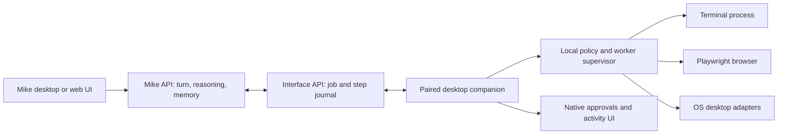

# Mike as a local computer agent

Status: proposed · 2026-09-28

## Product decision

Make the installed **Mike** app a conversational interface and a local agent
for the signed-in person's computer. Mike's model, conversation, planning,
memory, and account permissions remain on the server. A selected paired
desktop executes a bounded sequence of local steps and reports observations
back to that same Mike turn. The user can start and follow the turn from Mike
desktop or the website. The window stays Mike-only; there is no app hub.

The current file-picker flow is an optional guided action, not the desktop's
core ability. The core ability is to run terminal programs as the local user,
subject to a visible, device-local permission session. Add browser and desktop
adapters after the terminal loop works. Mike must never receive a network
endpoint that runs a submitted command without device, session, and local
authorization checks.

This plan concerns Linux desktop first. iOS, Android, and browser interfaces
reuse the task and event contracts but advertise only platform abilities they
can actually perform. They can all initiate and follow Mike turns.

## Current baseline and gaps

| Existing behavior | Consequence for this work |
| --- | --- |
| `mike-desktop` v0.3.0 has a focused WebKit conversation and a separate native Euglena companion. | Keep this interface and device identity. Do not make web JavaScript the executor. |
| `mike-interface-api` pairs per-user devices, records online capabilities, queues one task per selected device, and verifies a device credential on claim and completion. | Extend this gateway instead of adding a public desktop listener. |
| `RunInterfaceTask { goal, device_id? }` returns `InvocationAccepted`; `InvocationProgress` returns one final result. | Introduce a job with ordered step and output events. Preserve the old file-task protocol during migration. |
| Mike's `waiting_external` stage waits for that final result. Its normal action cap is six; `writes=true` causes a web approval before every new top-level action. | A multi-command job needs its own model/step loop, one goal-level approval, and explicit limits for steps, time, and output. |
| The desktop's bridge accepts only fixed file-task routes and uses a private loopback secret. | Keep loopback private. Add a local agent controller; do not expose `/run-command` to the WebView or public network. |
| `WhatCanIDo` currently describes local tasks as goals with no command/path input. | Advertise an `AgentJob` only when an online device has terminal support, with its mode and availability. |

## User experience

1. The user asks, “Mike, see why my app is slow on this computer.” Mike shows
   the target device and proposes a local diagnostic job. The user approves
   the goal and a permission mode. The desktop displays **Mike is working on
   this computer** with live commands, output summaries, elapsed time, Stop,
   and a way to inspect the full local log.
2. Mike can run `pwd`, `ls`, `ps aux`, `nvidia-smi` if present, inspect a
   project, run tests, and use installed CLIs. He sees exit status and
   bounded stdout/stderr, then plans another step. Missing tools are reported
   as missing; Mike must not invent their output or silently install them.
3. For a task such as “test my site,” Mike may start a Playwright-managed
   browser, navigate, capture evidence, and show a visible headed browser
   when the user requests it. The browser uses its own profile by default;
   connection to a person's existing browser is a separate permission.
4. Clipboard, screenshot, camera, microphone, and desktop input each appear
   only when supported on that machine. The user grants the relevant OS
   permission and, where appropriate, a Mike permission. A refusal returns a
   clear result to Mike. The user can speak or type in the desktop app even
   while a job runs.
5. Closing Mike, signing out, revoking the device, changing account, or
   pressing Stop ends the local job and its child processes. On reconnect,
   Mike shows the last *known* step, never claims an uncertain side effect
   succeeded, and never reruns that step automatically.

## Permission model

The desktop is capable of broad same-user access. This is a meaningful grant:
the account may contain private files, credentials, logged-in browsers, and
network access. Calling a shell command “read only” based on its text is not a
reliable security boundary. Policies must be enforced by the local executor
and, where isolation is promised, by the operating system.

| Mode | Behavior | Proposed default |
| --- | --- | --- |
| Supervised computer | Show the exact command, working directory, and target device before each command or sensitive adapter call. Approve, deny, or stop. Run as the signed-in OS user with no built-in elevation. | First release and unscoped tasks. |
| Workspace autonomy | User selects a project/workspace once. Commands run automatically in a tested OS sandbox with write access limited to that workspace and scratch space. Network and broader filesystem access require an explicit grant. | Second release after sandbox proof. |
| Trusted computer session | User explicitly grants broad same-user command execution on one named device for a short time or one job, with a persistent visible indicator and Stop. The grant expires and is never inferred from account sign-in or prior device pairing. | Opt-in only after supervision, audit, and recovery are proven. |

The server's goal approval and the desktop's execution permission are
different decisions. Mike's existing `writes=true` approval can authorize
starting a job; it must not be mistaken for permission to execute arbitrary
commands. Avoid two indistinguishable Yes/No prompts: the desktop should show
the goal, device, mode, and scope in one clear local grant. Later command
prompts follow the chosen mode. The web page can request a grant but cannot
create or extend one by itself. A grant is bound to owner, device, job,
mode, scope, expiry, and a fresh session identifier. Revocation is immediate
at the local worker and checked at the server on each step.

Do not promise “no sudo” merely because Mike runs under a user account:
some systems grant elevation to that account. The first release has no
elevation workflow, starts workers with no-new-privileges and without added
capabilities, and tests the supported distributions' elevation paths. A
future privileged mode would need a separate design and explicit OS approval.

## Architecture and protocol



Keep the outbound desktop-to-server HTTPS route initially. Polling can
continue for the first version; add a resumable WebSocket or SSE channel only
if measured latency and streaming needs justify it. No inbound public port,
SSH tunnel, or raw command endpoint is required. Keep the private loopback
bridge between the WebKit sidecar and Euglena companion; browser content
cannot invoke an OS tool directly.

The logical messages are versioned and typed, for example:

```text
StartAgentJob  { goal, device_id, requested_mode }
AgentJob       { job_id, owner, device_id, state, policy_version }
ProposeStep    { job_id, step_id, kind, argv?, cwd?, stdin?, timeout?, adapter_args? }
StepDecision   { step_id, approved|denied, grant_id? }
StepResult     { step_id, state, exit_code?, stdout_ref?, stderr_ref?, artifacts? }
CancelAgentJob { job_id }
AgentEvent     { job_id, sequence, type, summary, timestamp }
```

These are contract examples, not an invitation to send shell text through
the existing `goal` field. Mike's model proposes a step; the server validates
the schema and the gateway addresses it to one owned, online device. The
desktop independently checks the active grant and step limits, runs it, and
returns an observation. Mike then reasons over that observation and may
propose another step. `argv` execution is the normal terminal form; an
explicit shell form (`bash -lc`) is allowed only when the UI shows it as a
shell command and the selected mode permits it. Do not try to secure a shell
by filtering strings. Native adapter calls have typed arguments and their
own policy checks.

The job is a durable state machine: `offered → awaiting_local_grant → active
→ awaiting_step_approval/running → completed|denied|cancelled|expired|unknown`.
Give every step a unique ID, increasing sequence, lease, and final state.
Repeated requests return the same state and never rerun a finished or
uncertain command. A child process that outlives the lease is terminated.
Store bounded progress and metadata on the server; keep full terminal output
and artifacts local by default. Send Mike only the output needed for its next
decision, with truncation markers and an explicit request for further chunks.
Set limits on command duration, output bytes, artifact bytes, step count,
concurrent jobs, and total job duration. These values are versioned policy,
not model-controlled fields. The user can extend a job deliberately.

Bind jobs to the current account and device credential. Check ownership on
every claim, event, result, and cancellation. Use TLS in transit. Never put
tokens, credentials, commands, or output in URLs. Store credentials in
private local storage; avoid logging command output or filenames in server
telemetry. A device's advertised capabilities are informative; local policy
is authoritative at execution time. Version the protocol and tolerate one
prior desktop release during rollout.

### Threats to test explicitly

| Threat | Required behavior |
| --- | --- |
| A web page or prompt-injected file says “run this command.” | Its text is task data. The server may propose a step, but the local grant, target, and command review still apply. No web page can call the worker directly. |
| A command prints secrets or huge output. | Bound the bytes sent to Mike, label truncation, provide redaction/preview before user-approved sharing of sensitive artifacts, and keep full logs local by default. |
| A command spawns children or hangs. | A job-level process group and resource limits stop the whole tree on timeout, denial, sign-out, or Stop; test orphaned children. |
| A network command uploads private data. | Supervised mode shows the full command; workspace autonomy has no network unless granted. A trusted same-user session explicitly accepts broad network reach. |
| The server or device retries after a lost response. | Step IDs, leases, and recorded state prevent a second effect; return `unknown` where the outcome cannot be proven. |
| The user switches accounts or revokes a device. | The local grant ends immediately, queued steps are refused, and previous output is not shown to the new account. |

Treat files, web pages, command output, and clipboard content as untrusted
observations in Mike's next model prompt. Avoid placing them in the system
instruction channel. A trusted computer session deliberately grants broad
user-level authority; neither a command text filter nor a warning can turn
that grant into a restricted sandbox.

### Mike turn-loop changes

Implement an `agent_job` stage attached to the existing owner/turn. The
model's first action requests the job. After approval, Mike can issue step
proposals and consume results without repeating a top-level `RunInterfaceTask`
or counting each command against the six normal app actions. Apply separate
job bounds. `Progress` and `ActiveTurns` expose safe summaries so web and
desktop can join the same job. The final reply is based on observed results;
if a result is uncertain, Mike says so. Cancel and resume are first-class
operations. The host's dispatch thread must never wait for a process or a
person; all model calls and device waits remain asynchronous.

### Local execution and adapters

Use one supervised worker process per job, separate from the WebView and
native UI. It inherits only the environment it needs, has a fixed working
directory, bounded resources, a process group for cancellation, and no
privilege elevation. Record the exact binary, arguments, cwd, start/end time,
exit status, and redacted output locally. Distinguish a timed-out command
from a command that exited with an error. Do not run commands in the host
service's account or inside the server container.

Start with terminal execution and local file read/write through the terminal
policy. Then add:

- **Browser:** pinned Playwright and browser versions, managed isolated
  context by default, headless or headed mode, screenshot/trace artifacts,
  clear treatment of downloads and website permissions. The Mike WebView is
  not the automation browser.
- **Clipboard:** explicit read and write calls with content preview and size
  limits; use the platform's supported API. Do not assume a terminal CLI can
  bypass Wayland session permissions.
- **Screen and input:** use supported desktop portals, including their OS
  consent flow, for screenshot, screen sharing, or pointer/keyboard control.
  A request may be denied or unavailable in a session. Do not simulate
  consent or claim that installed software owns the whole desktop.
- **Camera/microphone:** separate capture sessions with visible indicators,
  OS permission handling, bounded media retention, and no background capture
  merely because a previous request was granted.

These adapters are optional platform strengths. The public protocol can name
their capabilities without requiring the same implementation on Linux,
Windows, macOS, iOS, Android, and web.

## Delivery sequence and gates

| Gate | Work | Required proof |
| --- | --- | --- |
| 0. Contract and UX | Replace the file-only product brief; prototype job card, grant, command review, output, Stop, reconnect, and two-device target. Define threat model and privacy budget. | Written acceptance criteria and clickable flow reviewed using a nontechnical account. |
| 1. Terminal worker | Build local process supervisor and policy in `mike-desktop`; verify terminal output, timeouts, cancellation, child cleanup, and refusal. Keep it unreachable from the public network and WebView JavaScript. | Native fixtures plus installed-bundle test; commands run as desktop user, never server user. |
| 2. Gateway journal | Extend `mike-interface-api` with versioned jobs, step leases/results/events, owner/device checks, cancel, expiry, replay safety, and two-device isolation. Keep old `RunInterfaceTask` working. | Native fixtures and real host API tests including crash/retry cases. |
| 3. Mike reasoning loop | Extend `mike-api` asynchronous turn state for iterative terminal steps and safe output; update `WhatCanIDo`. | Real Mike asks for `pwd`, `ls`, inspects output, chooses a second command, and gives an evidence-based answer without a six-action cutoff. |
| 4. User controls | Add native grant and step review, live activity and Stop in `mike-desktop`; show job state in `mike-web` and focused desktop route. | Browser, native, accessibility, account-switch, offline, and denial cases. |
| 5. Browser | Package pinned Playwright runtime and browser; support a managed browser session, headed mode, screenshots and traces. | Real site test with visible browser and reproducible artifact; no implicit access to personal browser cookies. |
| 6. Desktop adapters | Clipboard, screenshot, then input and media, each against supported OS APIs and consent behavior. | X11 and Wayland test matrix, permission deny/revoke, app-not-open, and artifact retention checks. |
| 7. Autonomy modes and release | Prove workspace sandbox, then offer explicit trusted sessions; update CDLVSM dependencies, version negotiation, rollback, and support docs. | Clean Ubuntu/Debian installs, upgrade from v0.3.0, release E2E, staged rollout, and rollback drill. |

The smallest useful release is gates 1–4: Mike can investigate the machine
through multiple terminal steps while a person supervises execution. A
Playwright demo is the next milestone, not a prerequisite for the terminal
loop. Do not ship an “autonomous workspace” label until its OS isolation has
been proven; do not ship an unrestricted trusted session as a hidden default.

Release the terminal loop behind a per-account feature flag, then to a small
opt-in cohort, then as the default. Measure job-start success, command
approval latency, cancellation success, unexpected child survival, device
disconnects, and failed installs without collecting command text or output.
Retain the v0.3.0 package and old gateway contract for rollback; stop new
jobs before rolling back a server that cannot interpret their protocol.

## Checkable acceptance criteria for the terminal release

- A signed-in user can start the same Mike job from the website or installed
  desktop, choose one of two paired computers, and see the same progress.
- Mike executes `pwd`, `ls`, `ps aux`, and an installed diagnostic CLI as a
  multi-step task; his final answer names only observations actually returned.
- The native window shows goal, device, mode, cwd, and each proposed command
  before it runs in supervised mode; deny and Stop prevent execution or end
  the running process tree.
- A model message, web script, different account, different device, expired
  grant, replayed step, or revoked device cannot run a command.
- No process runs as the server account or with an added privilege; the
  supported-image tests cover configured elevation paths.
- Output, stderr, exit code, timeout, truncation, and an unavailable command
  are distinct results. A crash after an uncertain effect is not replayed.
- Closing or signing out stops local execution; reconnect reports the actual
  last known state. Offline devices cannot accept a new job.
- The existing Mike conversation, memory, browser approvals, and guided file
  action remain working during migration; native and browser suites stay green.
- The tagged public bundle installs and starts through unpinned
  `cdlvsm install mike` on clean supported Ubuntu and Debian desktops.

## Follow-on platform contract

Every interface may originate a Mike turn and receive its answer. A device
may advertise terminal, browser, clipboard, screen, camera, microphone,
location, motion, notifications, or files only when supported and currently
available. The server routes one job to one selected device and never
silently retargets it. Mobile foreground/background restrictions and OS
permission state are reported as availability, not hidden failures. Web-only
abilities remain constrained to browser permissions. Native platform policy
always makes the final local execution decision.

## References for platform assumptions

- [Playwright browser contexts and isolation](https://playwright.dev/docs/browser-contexts)
- [Playwright browser installation](https://playwright.dev/docs/browsers)
- [XDG Remote Desktop portal and OS consent](https://flatpak.github.io/xdg-desktop-portal/docs/doc-org.freedesktop.portal.RemoteDesktop.html)
- [XDG Clipboard portal](https://flatpak.github.io/xdg-desktop-portal/docs/doc-org.freedesktop.portal.Clipboard.html)

This supersedes the file-first capability direction in plan 003. It retains
the Mike-only WebView, server-held conversation, and paired-device route that
plan delivered.
